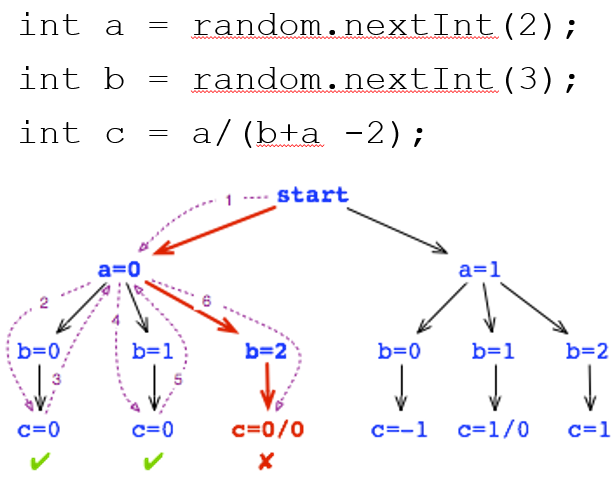

- [Exercise 5 - Static Analysis Part 1: Linters and Bug Finders](#exercise-5---static-analysis-part-1-linters-and-bug-finders)
  * [DrunkCarnivalShooter](#drunkcarnivalshooter)
  * [Applying SpotBugs and CheckStyle](#applying-spotbugs-and-checkstyle)
    + [Lessons on Pattern Matching](#lessons-on-pattern-matching)
  * [Submission](#submission)
  * [Resources](#resources)
- [Exercise 5 - Static Analysis Part 2: Model Checking](#exercise-5---static-analysis-part-2-model-checking)
  * [Applying Java Pathfinder (JPF)](#applying-java-pathfinder--jpf-)
    + [Applying JPF on Rand](#applying-jpf-on-rand)
    + [Applying JPF on DrunkCarnivalShooter](#applying-jpf-on-drunkcarnivalshooter)
    + [Applying JPF on JUnit to Unit Test DrunkCarnivalShooter](#applying-jpf-on-junit-to-unit-test-drunkcarnivalshooter)
    + [Lessons on Model Checking](#lessons-on-model-checking)
  * [Submission](#submission-1)
  * [GradeScope Feedback](#gradescope-feedback)
  * [Resources](#resources-1)

# Exercise 5 - Static Analysis Part 1: Linters and Bug Finders

* DUE: Oct 28, 2020 09:00 AM (Mon/Wed class)
* DUE: Oct 29, 2020 09:00 AM (Tue/Thu class)

In this exercise, you will use two static analysis tools to test a program: a
bug finder named SpotBugs and a linter named CheckStyle, SpotBugs and
CheckStyle work in similar ways in that both look for patterns that are either
symptomatic of a bug (former) or are bad coding style (latter).  So we will
look at them together first.  Later in Part 2, we will do model checking using
the Java Path Finder (JPF) which is much more rigorous in proving a program
correct.

## DrunkCarnivalShooter

DrunkCarnivalShooter is a simple text-based game where the player goes to a
carnival shooting range and tries to win the prize by shooting all 4 provied
targets.  The player can designate what target to shoot for pressing 0-3.  But
since the player is drunk, there is an equal chance of the player shooting left
or right as shooting straight.  Refer to the file
[sample_run.txt](sample_run.txt) for an example game play session.  You can
also try playing it yourself using the reference implementation:

```
$ java -jar DrunkCarnivalShooter.jar
```

To run the DrunkCarnivalShooter using the current implementation (for Windows users):

```
$ run.bat
```

For Mac or Linux:

```
$ bash run.sh
```

Now the current implementation contains several bugs.  In fact, the game throws
an exception immediately at start up:

```
$ java -cp bin;jpf-core/build/* DrunkCarnivalShooterImpl
Exception in thread "main" java.lang.NullPointerException
        at DrunkCarnivalShooterImpl.<init>(DrunkCarnivalShooterImpl.java:31)
        at DrunkCarnivalShooterImpl.main(DrunkCarnivalShooterImpl.java:150)
```

In this exercise, we are going to try to debug the program using static
analysis instead of dynamic testing.  So now let's go and try to find some
defects!

## Applying SpotBugs and CheckStyle

Try running both tools on DrunkCarnivalShooterImpl.java.  As usual, I've
provided scripts to run each tool.

To run CheckStyle (Windows users):

```
$ runCheckstyle.bat
```

To run CheckStyle (Mac/Linux users):

```
$ bash runCheckstyle.sh
```

To run SpotBugs (Windows users):

```
$ runSpotbugs.bat
```

To run SpotBugs (Mac/Linux users):

```
$ bash runSpotbugs.sh
```

CheckStyle and Spotbugs should print out several warnings each.  Refer to the
below references to find out what each warning means at fix your code at the
corresponding source code line:

* CheckStyle reference: https://checkstyle.sourceforge.io/checks.html  
If you don't understand a CheckStyle warning, read the corresponding entry inside google\_checks\_modified.xml under the checkstyle-jars folder and the above reference.

* SpotBugs reference: https://spotbugs.readthedocs.io/en/latest/bugDescriptions.html
* There is a GUI for SpotBugs if that is what you prefer.  You can launch the GUI by using the following command:
```
$ java -jar spotbugs-4.0.0-beta4/lib/spotbugs.jar
```
The following link contains a short tutorial on how to use the GUI:
https://spotbugs.readthedocs.io/en/latest/gui.html

SpotBugs will complain about among other things a warning type called
"ST_WRITE_TO_STATIC_FROM_INSTANCE_METHOD".  Look up the meaning of this error
type in the above SpotBugs reference.  It is saying that you should not update
a static variable from an instance method.  I have seen many of you do this a
lot in your assignments.  You would declare variables that should really be
instance variables to be static.  I don't know where you picked up that
programming habit, but that goes against all OOP principles.  If you are still
unsure about when to use static and when to use instance variables, here is a
good tutorial:

https://docs.oracle.com/javase/tutorial/java/javaOO/classvars.html

After removing all warnings, you should see the following ouput for each.

Checkstyle output:

```
$ java -jar checkstyle-jars /checkstyle-7.0-all.jar -c checkstyle-jars/google_checks_modified.xml src/DrunkCarnivalShooterImpl.java
Starting audit...
Audit done.
```

SpotBugs output:

```
$ java -jar spotbugs-4.0.0-beta4/lib/spotbugs.jar -textui -low -effort:max -longBugCodes -exclude spotbugs-4.0.0-beta4/my_exclude_filter.xml bin/*.class
The following classes needed for analysis were missing:
  org.junit.runner.JUnitCore
  org.junit.runner.Result
  org.junit.runner.notification.Failure
```

The missing classes are JUnit library classes.  We are not interested in
debugging the JUnit library, so we did not pass it to SpotBugs.

After fixing all the warning, now the program should at least start up properly, when run with run.bat:

```
$ java -cp bin;jpf-core/build/* DrunkCarnivalShooterImpl
Round #0:  ||    ||    ||    ||
Choose your target (0-3):
```

Yay!  But we are note done yet.  There are still bugs remaining.  Try repeatedly shooting the first target by choosing 0.

```
$ java -cp bin;jpf-core/build/* DrunkCarnivalShooterImpl
Round #0:  ||    ||    ||    ||
Choose your target (0-3):
0

...

Round #3:        ||    ||    ||
Choose your target (0-3):
0
Exception in thread "main" java.lang.ArrayIndexOutOfBoundsException: -1
        at java.util.ArrayList.elementData(ArrayList.java:422)
        at java.util.ArrayList.get(ArrayList.java:435)
        at DrunkCarnivalShooterImpl.isTargetStanding(DrunkCarnivalShooterImpl.java:125)
        at DrunkCarnivalShooterImpl.takeDownTarget(DrunkCarnivalShooterImpl.java:108)
        at DrunkCarnivalShooterImpl.shoot(DrunkCarnivalShooterImpl.java:89)
        at DrunkCarnivalShooterImpl.main(DrunkCarnivalShooterImpl.java:158)
```

The bug does not manifest in a deterministic way due to the randomness but you
will trigger it soon enough.  Or you may encounter another bug where the game
ends prematurely even when there are targets remaining.  These bugs are bugs in
the logic of the program and SpotBugs is not very good at finding these types
of bugs.  It only finds bugs that match a certain pattern.

### Lessons on Pattern Matching

Both linters (CheckStyle) and bug finders (SpotBugs) work by pattern matching.
Pattern matching can be good at finding simple bugs that are recurrent across
projects and can even catch errors in your documentation.  What they are not
good for is finding problems in your program logic (as seen above).  For that,
you need dynamic testing that actually executes the program to check program
behavior.  Or, you can use model checking that is able to *prove* that certain
correctness properties hold for all situations, even for random programs like
this one (see next section).

## Submission

Each pairwise group will do one submission to GradeScope, by *one member* of
the group.  The submitting member will press the "View or edit group" link at
the top-right corner of the assignment page after submission to add his/her
partner.  

You will create a github repository just for exercise 5, as usual.  Add your
partner as a collaborator so both of you have access.  Make sure you keep the
repository *PRIVATE* so that nobody else can access your repository.  When you
are done, submit your github repository to GradeScope at the **Exercise 5 Part
1 GitHub** link.  Once you submit, GradeScope will run the autograder to grade
you and give feedback.  If you get deductions, fix your code based on the
feedback and resubmit.  Repeat until you don't get deductions.

If you don't get any more warnings you've done your job.  Otherwise, it is -1
point for each CheckStyle or SpotBugs warning.

## Resources

* CheckStyle reference:  
https://checkstyle.sourceforge.io/checks.html  
If you don't understand a CheckStyle warning, read the corresponding entry inside google\_checks\_modified.xml under the checkstyle-jars folder and the above reference.

* SpotBugs reference:  
https://spotbugs.readthedocs.io/en/latest/bugDescriptions.html

# Exercise 5 - Static Analysis Part 2: Model Checking

* DUE: Nov 4, 2020 09:00 AM (Mon/Wed class)
* DUE: Nov 5, 2020 09:00 AM (Tue/Thu class)

In Part 2, you will use a model checker named Java Pathfinder (JPF) to prove
various correctness properties in your program.

* IMPORTANT: You need Java 8 (1.8.0.231, preferably) to run the Java Path
  Finder model checker.  Make sure you have the correct Java version by doing
"java -version" and "javac -version" before going into the JPF section.  If you
don't have the correct version, here is a link to a folder with installation
packages for each OS:

https://drive.google.com/drive/folders/1E76H7y2nMsrdiBwJi0nwlzczAgTKKhv7

## Applying Java Pathfinder (JPF)

Java Pathfinder is a tool developed by NASA to model check Java programs.  It
works in exactly the same way we learned in class: it does an exhaustive and
systematic exploration of program state space to check for correctness.

### Applying JPF on Rand

Let's first try out JPF on the example Rand program we saw on "Lecture 16:
Static Analysis Part 2" slides:  



First cd into the Rand directory before executing the scripts.

To run the Rand program (for Windows users):

```
$ run.bat
```

To run JPF with Rand:

```
$ runJPF.bat Rand.jpf
```

For Mac or Linux users, please run the corresponding .sh scripts.

When you run Rand with JPF, you can see from the screen output that it goes
through all possible states, thereby finding the two states with division-by-0
exception errors (I configured JPF to find all possible errors).  So, now we
know that there are two defective states, how do we debug?  You will see that
JPF has generated a trace file named [Rand.trace](Rand/Rand.trace) of all the
choices it had made to get to that state.  You will see two traces since there
are two defective states.  Pay attention to "cur" value of each Random.nextInt
invocation (that is the choice JPF has made for that invocation).  The first
trace shows values of 0, 2 for a, b and the second trace shows cur values of 1,
1 for a, b.  These are exactly the values that would cause a division-by-0
exception at c = a / (b + a - 2).  In this way, the trace file lets you easily trace
through the code to get to the defective state.

### Applying JPF on DrunkCarnivalShooter

Now let's cd out of the Rand directory to the root directory to once again work
on DrunkCarnivalShooter.  The following script applies JPF to
DrunkCarnivalShooter.

For Windows users:

```
$ runJPF.bat DrunkCarnivalShooter.win.jpf
```

For Mac/Linux users:

```
$ bash runJPF.sh DrunkCarnivalShooter.macos.jpf
```

If you run the above, JPF will immediately display an error similar to the following:

```
...
====================================================== search started: 10/25/20 9:54 PM
Round #0:  ||    ||    ||    ||
Choose your target (0-3):

====================================================== results
no errors detected
...
```

No errors, yay!  So are we done?  No, far from it.  From the search output, you
can see that the search ended immediately at the first point of user input.
That is because JPF is not designed to receive user input from the terminal.
Instead, JPF uses a set of APIs under the Verify class (gov.nasa.jpf.vm.Verify)
to specify the set of user input(s) we want to test.  Then, it **exhaustively
tests the program for each user input**.

In order to be able to use this feature, we first have to import the class at
the top of DrunkCarnivalShooterImpl.java:

```
import gov.nasa.jpf.vm.Verify;
```

Then replace calls to Scanner with calls to Verify only when the commandline
argument "test" is passed to the program.  The "test" argument will put the
program in test mode and not in play mode.  You can see "test" is already
configured as the commandline argument in the target.args entry in
[DrunkCarnivalShooter.win.jpf](DrunkCarnivalShooter/DrunkCarnivalShooter.win.jpf).
This will allow us to still play game the game in normal mode.

In test mode, do not create Scanner and instead of scanning user input using
the following statement:

```
int t = scanner.nextInt();
```

replace it with the following:

```
int t = Verify.getInt(0, 3);
```

The above will direct JPF to generate 4 states each where t is set to 0, 1, 2,
or 3 respectively.  Then it will systematically explore each state.  If you
wish, you can test a larger set of numbers beyond 0-3.  It is just going to
generate more states and take longer (the flipside being you will be able to
model check your program against a larger set of inputs).

Now let's try running runJPF.bat one more time like the above.  This will show
a new error message due to an exception:

```
====================================================== search started: 10/25/20 10:01 PM
Round #0:  ||    ||    ||    ||
Choose your target (0-3):

====================================================== error 1
gov.nasa.jpf.vm.NoUncaughtExceptionsProperty
java.lang.ArrayIndexOutOfBoundsException: -1
        at java.util.ArrayList.elementData(java/util/ArrayList.java:422)
        at java.util.ArrayList.get(java/util/ArrayList.java:435)
        at DrunkCarnivalShooterImpl.isTargetStanding(DrunkCarnivalShooterImpl.java:124)
        at DrunkCarnivalShooterImpl.takeDownTarget(DrunkCarnivalShooterImpl.java:108)
        at DrunkCarnivalShooterImpl.shoot(DrunkCarnivalShooterImpl.java:89)
        at DrunkCarnivalShooterImpl.main(DrunkCarnivalShooterImpl.java:163)
...
```

Wait, this is the same exception that we randomly experienced previously!  Use
the trace generated as part of the output to find the input value(s) and the
random value(s) that led to the exception.  Interpret it in the same way you
did Rand.trace.  The trace should look like:

```
====================================================== trace #1
------------------------------------------------------ transition #0 thread: 0
gov.nasa.jpf.vm.choice.ThreadChoiceFromSet {id:"ROOT" ,1/1,isCascaded:false}
      [50072 insn w/o sources]
------------------------------------------------------ transition #1 thread: 0
gov.nasa.jpf.vm.choice.BreakGenerator {id:"MAX_TRANSITION_LENGTH" ,1/1,isCascaded:false}
      [48603 insn w/o sources]
------------------------------------------------------ transition #2 thread: 0
gov.nasa.jpf.vm.choice.IntIntervalGenerator[id="verifyGetInt(II)",isCascaded:false,0..3,delta=+1,cur=0]
      [22 insn w/o sources]
------------------------------------------------------ transition #3 thread: 0
gov.nasa.jpf.vm.choice.IntIntervalGenerator[id="verifyGetInt(II)",isCascaded:false,0..2,delta=+1,cur=0]
      [64 insn w/o sources]
...
```

Now let's try to break down that trace.  A transition happens in the course of
travering the program state space.  Whenever there is a "choice" between one
more program states, a transition is recorded with the selected choice.  When
is JPF presented with a choice?

1. When it encounters Verify.getInt, it is presented with a range of user
   inputs each of which represents a separate path that JPF can take.  Same
thing applies to all the other Verify APIs.

1. When it encounters Random.nextInt, it is presented with a range of random
   values that the random number generator can return, each of each again
represents a different program state.

1. When the program is multithreaded (parallel), JPF is also presented at each
   instruction with a choice of whether to context switch and execute another
thread.  This is what transition #0 is.  This is how JPF can exhaustively
explore all thread interleavings.  If you don't know what that means, don't
worry about it.  It is beyond the scope of this class.  Feel free to ask if you
are curious :).

In the above trace, it is important to understand transitions #2 and #3.  What
would be transition #2 with choice interval 0..3?  It would be the
Verify.getInt(0, 3) that replaced the scan of user input.  And according to the
trace it returned 0 ("cur=0").  What would be transition #3 with choice
interval 0..2?  It would be the rand.nextInt(3) used to add randomness to the
shooting target, and in the trace it also returned 0 ("cur=0").  So it's the
case where the user chose target 0 and the randomness of the shooting pulled
the bullet to the left.  What's on the left side of target 0?  That should help
you track down the problem.  **Hint: What happens when t becomes -1 in isTargetStanding?**

Once you fix these bugs, try running runJPF.bat one more time.  Now that you
have fixed the buggy state JPF runs for much longer.  In fact, JPF is going to
fall into an infinite loop and generate an infinite number of states (observed
by the ever increasing Round number).

```
...
Round #20:
  ||    ||    ||
Choose your target (0-3):
You aimed at target #0 but the Force pulls your bullet to the left.
You miss! "Do or do not. There is no try.", Yoda chides.

Round #21:
        ||    ||    ||
Choose your target (0-3):
You miss! "Do or do not. There is no try.", Yoda chides.

... (to infinity)
```

There is no theoretical limit to the number of rounds a player can play, hence
the state explosion.  How can I deal with this explosion and still verify my
program?

We have to somehow narrow down the amount of state we test, or we will be
forced to but JPF off after testing only a limited set of rounds.  Let's say
the state that we are really interested in relation to the specifications is
the state of the 4 targets.  Now if you think about it, the 4 targets can only
be in a handful of states: 2 * 2 * 2 * 2 = 16 states (standing or toppled for
each).  And this is true no matter how many rounds you go through.  The only
thing that constantly changes every round is the round number --- and that is
the culprit leading to the state explosion.  The round number is not something
we are interested in verifying right now.  So, let's filter that state out!

Import the appropriate JPF library at the top of DrunkCarnivalShooter.java again:

```
import gov.nasa.jpf.annotation.FilterField;
```

And now, let's annotate roundNum such that it is filtered out:

```
@FilterField private int roundNum;
```

Now if we run runJPF.bat again, JPF will only go up to Round #2 and stop and declare "no errors detected".

```
...
Round #2:

Choose your target (0-3):

====================================================== results
no errors detected
```

But why Round #2?  We would expect that 4 rounds would be needed to cover all
the 16 possible states.  In fact, if you see the output, you can see it does
not cover all the possible 16 states.  And somehow the game is able to
terminate after 2 rounds.  So the game now does not throw any exceptions but
still malfunctions.

JPF can only check for systems properties that it knows about while traversing
the program state space.  If you don't tell it anything, the only thing JPF
knows about a Java program is that it should not throw exceptions at any point.
If you want to check that your program behaves in a certain way according to
the requirements, you need to tell JPF about these additional properties.  The
way to encode properties is though assertions that assert the given invariant
property at that point of execution.  There are two options to insert these
assertions:

1. The assertions be embedded in your program code in the form of Java assert
   statements.  This is useful in the context of systems testing your code as
these assertions will be checked while your system is running.  But this has
the drawback that your testing code is mixed in with your implementation code
which is not good for code readability and/or maintenance.  Also, it is hard to
apply unit testing in a systematic way.

1. The other option is to use JPF as part of the JUnit testing framework.
   JUnit will check for defects by checking postconditions using JUnit
assertions, just like with regular unit testing.  But each of the JUnit tests
become comprehensive and exhaustive thanks to JPF, even in the face of random
program behavior.  JPF makes sure that the invariant assertion holds for all
the random behaviors the program can display.  It also does this for all
possible user inputs if the Verify API is used.

We will choose the latter option.

### Applying JPF on JUnit to Unit Test DrunkCarnivalShooter

Now we are not systems testing DrunkCarnivalShooter.  We want to invoke JUnit
on DrunkCarnivalShooter.  The script to do that is as follows:

```
runJPF.bat JUnit.win.jpf
```

For Mac or Linux:

```
bash runJPF.sh JUnit.macos.jpf
```

If you peek into JUnit.win.jpf (or JUnit.macos.jpf), you will notice that now
the execution target is set to TestRunner instead of DrunkCarnivalShooter:

```
target = TestRunner
```

TestRunner invokes JUnit on the DrunkCarnivalShooterTest test class.  As is,
DrunkCarnivalShooterTest.java is incomplete and does not do much.  Fill in the
locations with // TODO comments inside DrunkCarnivalShooterTest.java.  In the
setUp method, use the Verify API such that you enumerate all the 16 possible
states that the game can be in, as well as the target choice made by the user
(0-3).  In this way, each of your JUnit test cases will be tested on all
possible states the game can be in with all possible user inputs.

In the testShoot() method, implement the preconditions, execution steps, and
the invariant to test the shoot(targetChoice, builder) method as explained in
the method comment.  The invariant is a property that must hold no matter the
game state and the target choice.  For this test, the invariant chosen was the
remaining number of targets, because it appears that the game is ending
prematurely thinking that there aren't any more targets.

I recommend that you always insert the failString that I initialized for you in
the setUp method as the first argument of any JUnit assert call so that you get
that as part of your failure message.  For example,

```
assertEquals(failString, expected value, observed value);
```

The failString tells you the combination of game state and target choice that
led to the failure, which helps you debug the problem.  Feel free to append
additional information to the failString that may help you debug.

If you implemented the test properly, you should see a long list of errors for
different combinations.  Debug DrunkCarnivalShooterImpl to remove the errors.
Now if you play the game, you should not see any defects.

### Lessons on Model Checking

What have we learned?  We learned that a model checker such as JPF can
guarantee correctness for the given set of inputs.  But in order to do that,
you often need to limit the amount of state JPF monitors to prevent state
explosion.  Also, the guarantee of correctness depends heavily on how much of
the program specification you have encoded into your testing in the form of
assertions.  If there are no assertions, JPF can only check only basic things
such as no exceptions.

## Submission

When you are done, submit your Exercise 5 github repository to GradeScope at
the **Exercise 5 Part 2 GitHub** link.  Once you submit, GradeScope will run
the autograder to grade you and give feedback.  If you get deductions, fix your
code based on the feedback and resubmit.  Repeat until you don't get
deductions.

## GradeScope Feedback

The GradeScope autograder works in 2 phases:
1. DrunkCarnivalShooterTest on DrunkCarnivalShooterImpl

   This runs your DrunkCarnivalShooterTest JUnit test on your
DrunkCarnivalShooterImpl, with the help of JPF to do exhaustive state
exploration.  Assuming your implementation is bug-free, it should not turn up
any JUnit test failures.

1. DrunkCarnivalShooterTest on DrunkCarnivalShooterBuggy

   This runs your DrunkCarnivalShooterTest JUnit test on the buggy
DrunkCarnivalShooterBuggy implementation, again with the help of JPF.  Since
this implementation is buggy, JPF should find states where there are JUnit test
failures.

If you have trouble, try comparing your JPF outputs against these expected
outputs:

* Result of running DrunkCarnivalShooterImpl standalone on top of JPF:
  ```
  runJPF.bat DrunkCarnivalShooter.win.jpf
  ```
  OR
  ```
  bash runJPF.sh DrunkCarnivalShooter.macos.jpf
  ```
  Expected output: [jpf_drunkcarnivalshooter_run.txt](jpf_drunkcarnivalshooter_run.txt)

* Result of running DrunkCarnivalShooterTest on DrunkCarnivalShooterImpl on top of JPF. Corresponds to the autograder phase 1 output:
  ```
  runJPF.bat JUnit.win.jpf
  ```
  OR
  ```
  bash runJPF.sh JUnit.macos.jpf
  ```
  Expected output: [jpf_junit_run.txt](jpf_junit_run.txt).  

* Result of running DrunkCarnivalShooterTest on DrunkCarnivalShooterBuggy on top of JPF. Corresponds to the autograder phase 2 output.  First uncomment "target.args = buggy" in JUnit.win.jpf or JUnit.macos.jpf, depending on your OS.  Then run:
  ```
  runJPF.bat JUnit.win.jpf
  ```
  OR
  ```
  bash runJPF.sh JUnit.macos.jpf
  ```
  Expected output: [jpf_junit_buggy_run.txt](jpf_junit_buggy_run.txt).
  
Minor details like elapsed time statistics can differ but the search output and
the results output should look the same.  Also, note that now the former goes
up to Round #4 and covers all possible 16 target configurations.

## Resources

* JDK 8 installation packages:  
https://drive.google.com/drive/folders/1E76H7y2nMsrdiBwJi0nwlzczAgTKKhv7

* Java Path Finder manual:  
https://github.com/javapathfinder/jpf-core/wiki/How-to-use-JPF
http://javapathfinder.sourceforge.net/

* Java Path Finder Verify API:  
https://github.com/javapathfinder/jpf-core/wiki/Verify-API-of-JPF
